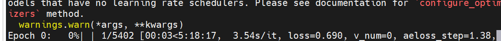

# SOVAE

这里是一阶段训练的代码。

## 数据处理

下载完imagenet数据集后，需要生成两个文件`train.txt`和`val.txt`，一个存储训练集的图像路径，一个存储验证集的图像路径(建议绝对路径)。可以使用[build_filelist.py](./build_filelist.py)获取。

```
train.txt
xxxx.JPEG
xxxx.JPEG
xxxx.JPEG
...
xxxx.JPEG

val.txt
xxxx.JPEG
xxxx.JPEG
xxxx.JPEG
...
xxxx.JPEG
```

## 环境配置

```
conda env create -f environment.yaml
conda activate taming
```

由于taming原始仓库比较老了，所以可能原始的配置无法在现在的环境中正常运行，此时可更换`environment.yaml`为[`environment_modified.yaml`](./environment_modified.yaml)，或者作为参考进行环境搭建。

## 训练设置

训练指令如下：

```
python main.py --base configs/imagenet_sorl.yaml -t true --gpus 0,1,2,3,4,5,6,7
```

需要注意一些额外的参数配置：
- `--gpus`：指定gpu，若为单个的时候，请使用`--gpus 3,`的形式调用
- `-p`：指定ckpt的存放位置，如果没有指定，默认存放在与`main.py`同文件夹下的`logs`中
  
关于[`imagenet_sorl.yaml`](./configs/imagenet_sorl.yaml)的配置需求：
- `training_images_list_file`：填写为上面数据处理中生成的`train.txt`的路径
- `test_images_list_file`：填写为上面数据处理中生成的`val.txt`的路径
- `batch_size`：指定的是每张卡上的batch_size，需手动调整到能够占满显存的数值

## 关于是否正常运行的判断

- 成功运行后应会出现下面的形式：
    
- 在存储ckpt的位置（若没有特殊指定，则在`sovae/logs`下），会出现checkpoints,images,configs,testtube四个文件夹 